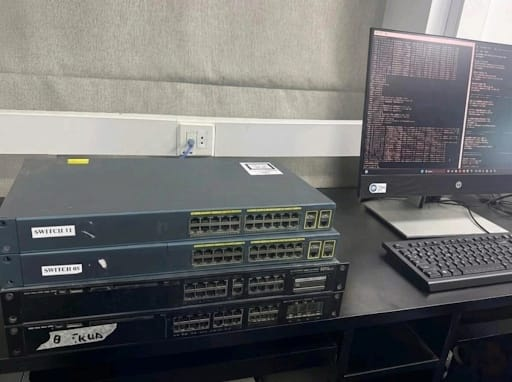
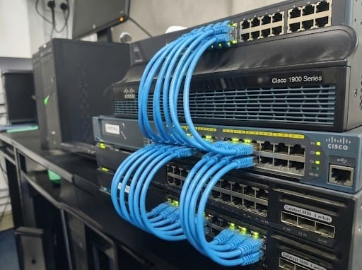

# Enterprise Network Infrastructure Implementation

## 📌 Project Overview
This project involves the design and physical implementation of a scalable enterprise network infrastructure. It simulates a corporate environment requiring High Availability (HA), security, and segmented traffic management.

The implementation includes the configuration of physical Cisco hardware (Routers and Switches) integrated with a virtualized server environment (VMware) to provide core network services like DHCP and DNS.

---

## 🏗️ Architecture & Topology

  

### Hardware Components
* **Routing:** 1x Cisco ISR Router (Main Gateway)
* **Core/Distribution:** 2x Cisco Layer 3 Switches
* **Access:** 2x Cisco Layer 2 Switches
* **Endpoints:** 3x Host PCs (Simulating end-users)
* **Server:** VMware Workstation Host running Windows Server 2019

---

## ⚙️ Key Configurations & Technologies

### 1. Switching & VLANs
* **VLAN Segmentation:** Created distinct broadcast domains for Departments (HR, IT, Sales) and Management.
* **VTP (VLAN Trunking Protocol):** Configured for centralized VLAN management across the switched fabric.
* **EtherChannel (LACP):** Implemented link aggregation between Layer 3 and Layer 2 switches to increase bandwidth and redundancy.
* **Port Security:** Enabled sticky MAC addressing to prevent unauthorized access at the edge.

### 2. Routing & High Availability
* **Inter-VLAN Routing:** Configured SVI (Switch Virtual Interfaces) on Layer 3 switches.
* **OSPF (Open Shortest Path First):** Implemented Single-Area OSPF (Area 0) as the link-state dynamic routing protocol for efficient internal network reachability.
* **HSRP (Hot Standby Router Protocol):** Configured on L3 switches to provide default gateway redundancy and failover capabilities.
* **NAT (Network Address Translation):** Configured overload (PAT) for internet access.

### 3. Services & Virtualization
* **Hybrid Cloud Setup:** Integrated physical network with VMware Workstation Pro.
* **DHCP Relay:** Windows Server configured as the centralized DHCP server; Helper addresses configured on SVI interfaces to relay requests across VLANs.
* **Management:** SSH enabled for secure remote management; Syslog and TFTP servers configured for logging and backup.
* **ACLs:** Extended Access Control Lists implemented to restrict traffic flow between specific departments and servers.

---

## 📸 Physical Implementation Gallery

 

  
   
   
  <em>Figure 1: Front view of the rack configuration showing the Catalyst switches.</em>

  
   
   
  <em>Figure 2: Detailed view of the structured cabling at the rear of the stack.</em>

---

## 🚀 How to Use

The configuration files located in the `/configs` folder are sanitized outputs from the running-config of each device. You can view the specific command structures for each device layer below:

### 📂 Configuration Quick Access

  
| Device Role | Hostname | Config File |
| :--- | :--- | :--- |
| **Core Router** | `R1` | [📄 View Core-Router-R1.txt](./Configs/Core-Router-R1.md) |
| **Distribution Switch 1** | `DSW1` | [📄 View L3-Switch-DSW1.txt](./Configs/L3-Switch-DSW1.md) |
| **Distribution Switch 2** | `DSW2` | [📄 View L3-Switch-DSW2.txt](./Configs/L3-Switch-DSW2.md) |
| **Access Switch 1** | `ASW1` | [📄 View L2-Switch-ASW1.txt](./Configs/L2-Switch-ASW1.md) |
| **Access Switch 2** | `ASW2` | [📄 View L2-Switch-ASW2.txt](./Configs/L2-Switch-ASW2.md) |

### Deployment Instructions
1.  **Review Logic:** Click the links above to inspect the specific command hierarchy (VLAN creation, OSPF/EIGRP config, HSRP standby groups).
2.  **Simulation/Lab:** These configs can be copied directly into **Cisco Packet Tracer** or **GNS3** (with minor interface name adjustments depending on your module type).
3.  **Physical Deployment:** For real hardware, ensure you wipe the current configuration (`write erase`) before pasting these commands via console.

## 🏆 Learning Outcomes
* Deployed a robust hierarchical network model (Core, Distribution, Access).
* Mastered physical layer troubleshooting (cabling, interface status, duplex mismatches).
* Successfully integrated virtualized server services (DHCP/DNS) into a physical routing domain.

---
*Created by [Your Name]*
